# Design audit

Home, About, Approach, Investment Focus and Company, in English and Japanese, at desktop
(1440px) and phone (390px) width. Nothing was changed; this records what is there.

**What was audited.** `main` (`1713859`) plus the header restore on `claude/header-restore`
(`a8add56`), i.e. the version about to go live. Chromium 141, real screenshots and
measurements from the rendered DOM, so where a claim has a number it is measured, not
judged by eye. Safari and real iPhones were not available; phone findings are from a 390px
viewport.

**How it is ranked.** By how much each issue damages the impression a high-net-worth
investor forms in the first minute: premium, careful, trustworthy. Not by effort to fix.

## The short version

The site's bones are good. The restraint is right, the dark plum panels and hairline
system feel considered, the London and Amsterdam photography is strong, and the Home
headline has a clear first, second and third thing to look at. What lets it down is that
**the images that make the first impression are the weakest on the site, several
components are built three different ways, and a handful of small faults sit exactly
where a careful reader looks.** Most of those are the kind of thing an investor cannot
name but does register as "not quite finished".

## Ranked findings

| # | Issue | Where | Reads as |
|---|---|---|---|
| 1 | The four hero images are out-of-focus blurs that do not belong together | all four hero pages, both languages | placeholder, template |
| 2 | Card titles unreadable over pale stone | Home and Investment Focus, both languages, worst on phones | a mistake on the core proposition |
| 3 | Footer text collides on phones | every page, both languages | broken |
| 4 | Japanese typography has real errors | Japanese Home at 1440, all Japanese body copy | an afterthought |
| 5 | The type scale is not a scale | every page | unconsidered |
| 6 | Same component, different construction | arrows, numbering, columns, card gaps | unfinished |
| 7 | Alignment slips | Home, About | careless |
| 8 | Spacing outliers | Investment Focus, Approach, About | rushed |
| 9 | Too much text at 12 to 13px, greyed | Approach, footer, nav | hard to read, especially for older readers |
| 10 | No proof of who is behind it | whole site | thin for a trust product |
| 11 | Maps look like a default basemap; legend shown twice | About | template |
| 12 | Legal pages leave the grid; small finishing details | Privacy, Disclaimer, Investment Focus, Approach | polish |

### 1. The hero images (highest impact)

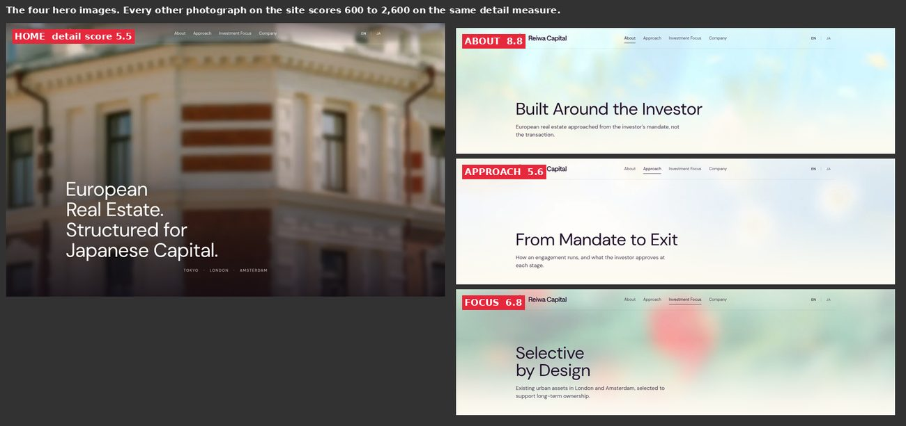

The Home hero is a photograph of a building corner blurred until the windows and cornice
are half-resolved. It does not read as a deliberate abstract; it reads as an image that
failed to load at full resolution. The three inner heroes are not photographs at all but
colour washes, and each is a different mood: pale blue and yellow (About), almost white
(Approach), and mint green with a coral blob (Investment Focus). None of them relates to
the Home hero or to each other.

Measured, using a standard fine-detail score on each image: the four heroes score **5.5,
8.8, 5.6 and 6.8**. The four content photographs I scored (London, Amsterdam, Income, Hospitality) score **600 to 2,600**. The first
thing a visitor sees carries roughly 100 to 400 times less detail than the images below
it, so quality *falls* as you scroll in a place where it should build.

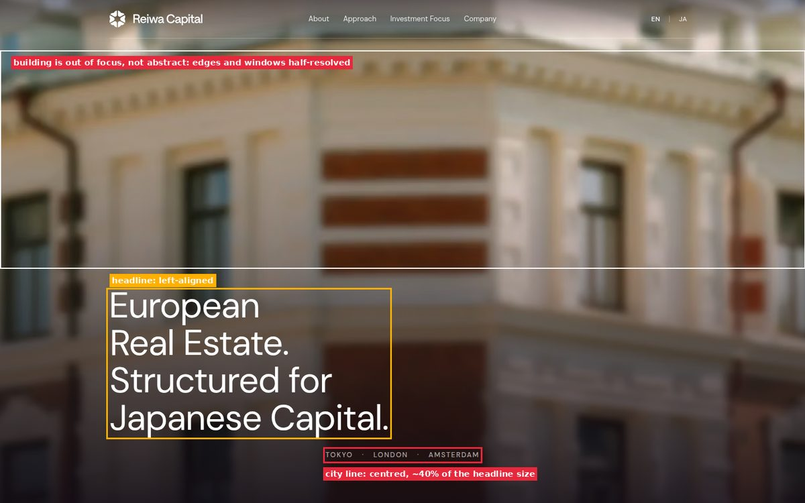

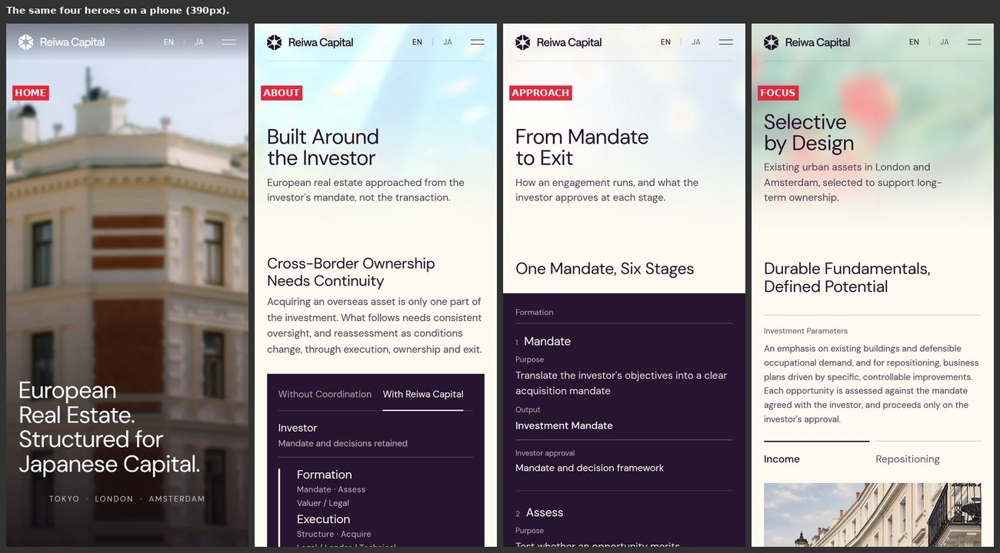

Approach is the extreme case: the wash is so faint the top of the page looks empty, and it
could be mistaken for a missing image. The Investment Focus coral blob sits directly
behind the headline and is the most saturated thing on a site whose palette is plum and
cream.

The Home headline itself is good: large, light, left-aligned, legible. The city line
beneath it ("TOKYO · LONDON · AMSTERDAM") is centred while the headline is left-aligned,
which mixes two alignments in one composition (see #7).

### 2. Card titles unreadable over pale stone

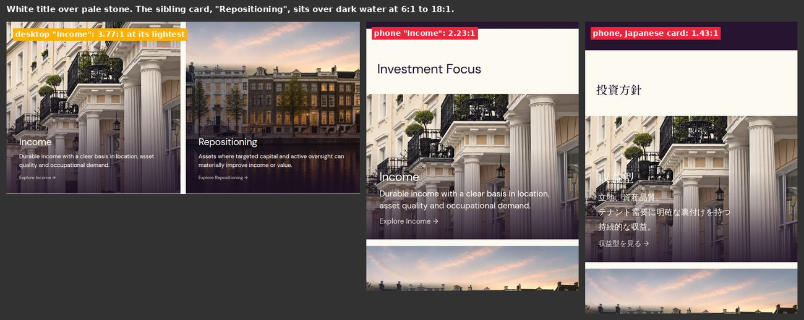

"Income" (and the Japanese "収益型") is white text over the pale columns of the London
terrace. Contrast of the title against the lightest tenth of the ground behind it:

| card | desktop | phone |
|---|---|---|
| Income | 3.77 : 1 | **2.23 : 1** |
| 収益型 (Japanese) | 3.18 : 1 | **1.43 : 1** |
| Repositioning / 再生型 | 11 to 13 : 1 | 6 : 1 |

The sibling card sits over dark water and is fine. So the two core propositions are not
equally legible, and the first one, which is the one investors read first, is the weaker.
On a phone the Japanese title is close to invisible. It appears on Home and again on
Investment Focus.

### 3. Footer collision on phones

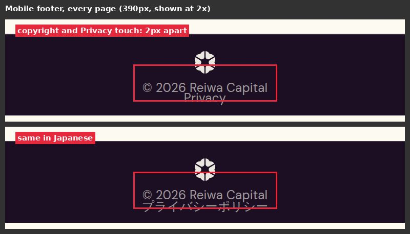

Below about 480px the footer stacks emblem, copyright and Privacy with the last two lines
2px apart, so "© 2026 Reiwa Capital" and "Privacy" touch. Every page, both languages. It is
the last thing on every page and on a phone it is broken.

### 4. Japanese typography

The Japanese pages are, in places, more refined than the English (serif headlines, good
line length of roughly 30 characters). But there are real errors, and Japanese-reading
investors will see them.

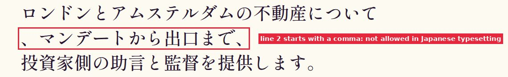

- **A line starts with `、`** in the Home statement heading at 1440px. Japanese
  typesetting forbids a line beginning with a comma. It only happens at that width, but
  1440 is a very common laptop width. Cause: the heading is set to keep words whole with a
  safety valve, and at 1440 the first clause is wider than its column so the valve fires
  and breaks just before the comma. It is long-standing, not recent.
- **Body copy breaks inside words** on phones.

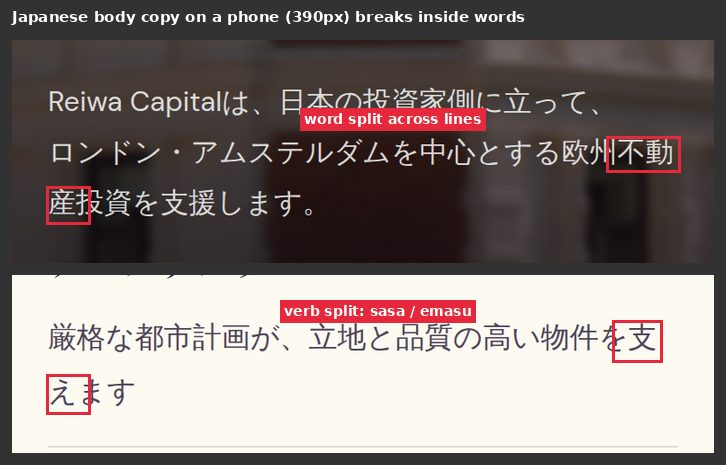

  Examples: 不動|産投資 and 支|えます. Katakana words are now protected; kanji compounds
  and verbs are not. Chromium's phrase-aware breaking hides most of this; Safari, the browser on iPhones and so
  on a large share of Japanese phones, does not have it.
- **The Japanese hero carries a sentence the English lacks**, in a different typeface
  (serif headline against sans-serif English).

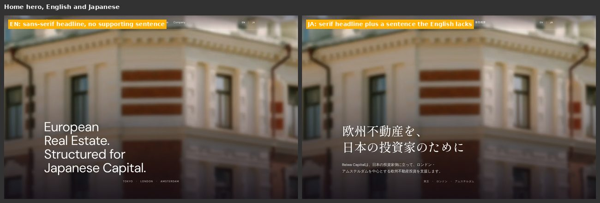

  That may be intentional, but the two hero compositions are not the same design.
- Navigation labels are 13px in Japanese, small for kana and kanji.

### 5. The type scale is not a scale

Measured at 1440px, the same role renders at different sizes on different pages:

| role | sizes seen |
|---|---|
| H1 | Home 64px, About / Approach / Focus 57px, Company 44px |
| Main H2 | Home 42 and 33px, About 33px, Approach 38px, Focus 38 / 28 / 22px, Company 26px |

Within a page the hierarchy also goes flat. On About, "Focus Markets", "London" and
"Amsterdam" are all 33.2px H2s; the section title and its two subsections are
indistinguishable in size. In the Approach panel the group labels (Formation, Execution,
Ownership) are 14px at 66% opacity, smaller and greyer than the stage names beneath them,
so the parent is quieter than the child. The stage numerals themselves render at **6.4px**.

### 6. The same component, built differently

Wherever the site repeats a device, it repeats it in a new form:

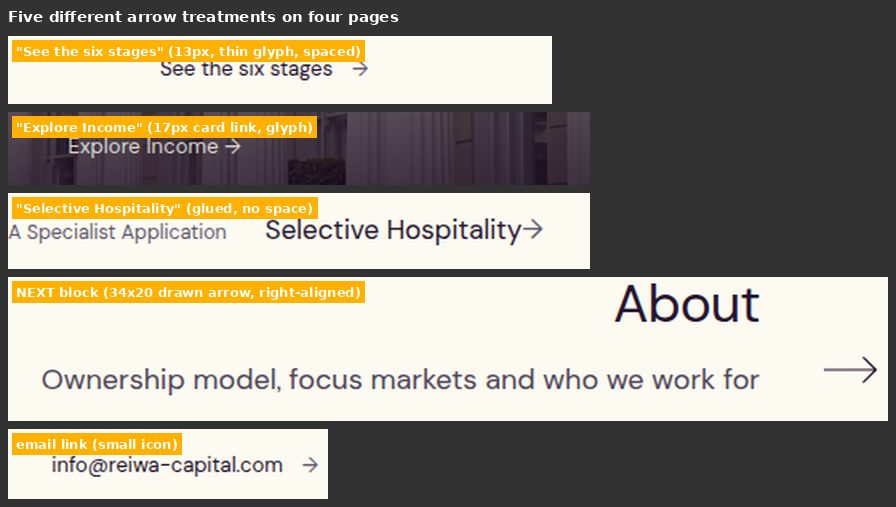

**Arrows:** five treatments across four pages (thin glyph with a space, 17px glyph in a
card, a glyph glued to its word, a long 34px drawn arrow in the NEXT blocks, a small icon
on the email link).

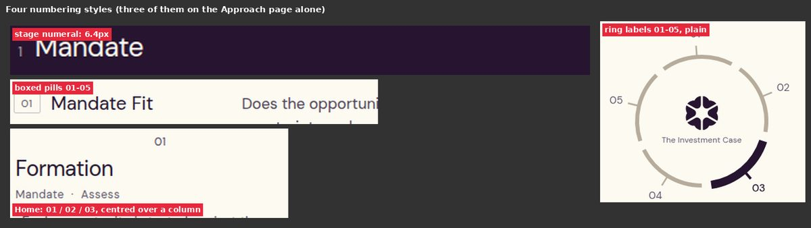

**Numbering:** the Approach page alone uses a 6.4px subscript numeral, plain ring labels
and boxed pills; Home uses a fourth (centred 01 / 02 / 03).

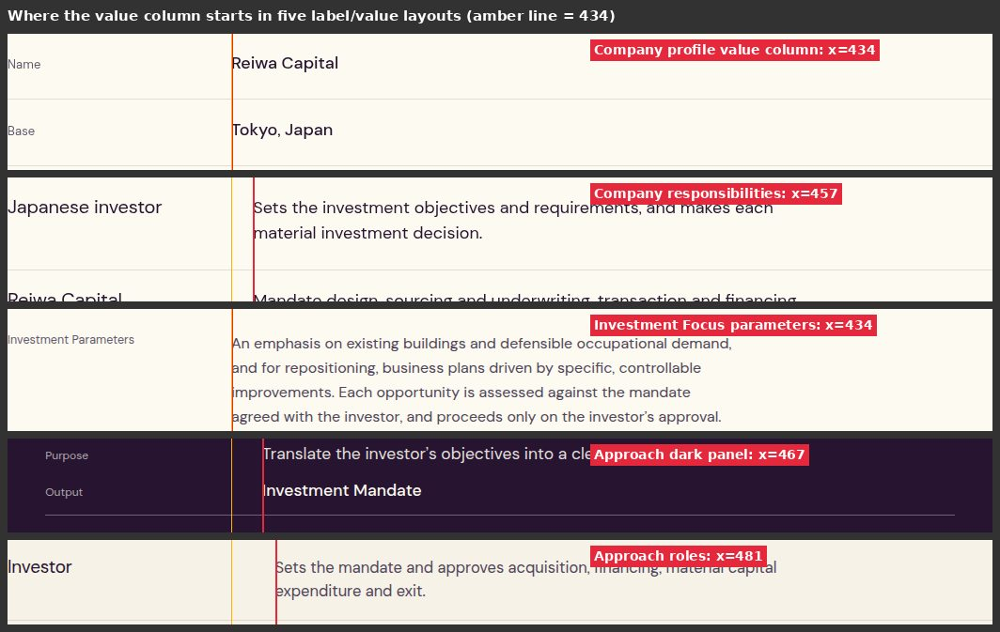

**Label and value layouts** start their value column at x = 434, 457, 467 and 481 within
one 1048px grid.

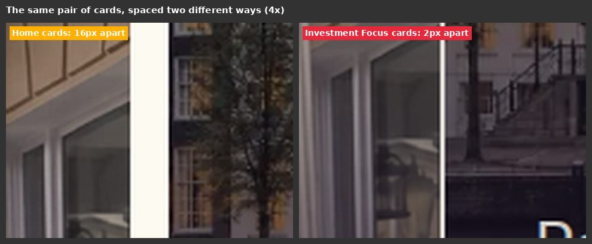

**Paired photo cards** sit 16px apart on Home and 2px apart on Investment Focus. Three-column
blocks use a horizontal rule with a dark tab on Home, a plain rule on Focus and vertical
dividers in the dark band.

### 7. Alignment slips

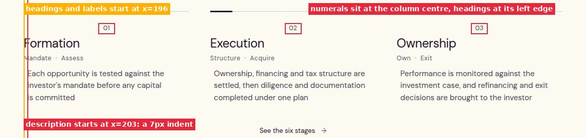

On Home, the description under each of the three stages starts 7px to the right of its own
heading, and the 01 / 02 / 03 numerals sit at the column centre while everything else in
the column is left-aligned. The link beneath ("See the six stages") is centred, and the NEXT
blocks are right-aligned, on a site that is otherwise left-aligned.

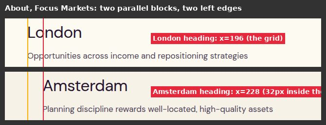

On About, the Amsterdam block sits 32px inside the grid the London block uses, so two
parallel sections have different left edges.

### 8. Spacing outliers

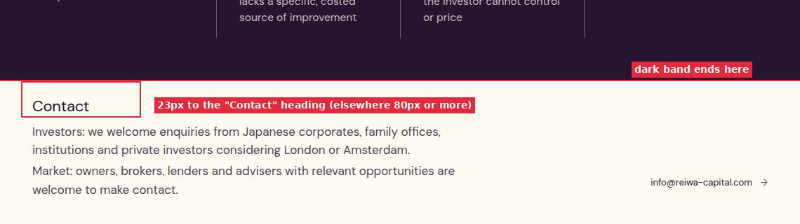

The Contact block on Investment Focus starts **23px** below the edge of the dark band above
it. Blocks elsewhere on that page are 102 to 127px apart. It also floats its email link at
the right, disconnected from the text, and looks nothing like the Contact section on the
Company page, which is done well.

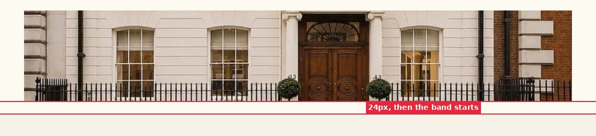

The photograph strip on Approach is followed by the next band after 24px. On About there is
373px of empty band below the Amsterdam block, against a page median of about 170px.

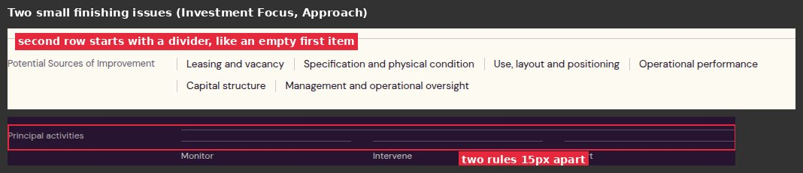

Smaller: the "Potential Sources of Improvement" list wraps to a second row that begins with a
divider, and the Approach panel has two hairlines 15px apart near "Principal activities".

### 9. Small, greyed text

Text at 13.5px or smaller: 228 characters on Home, 348 on Approach (287 of them at 12px),
414 on Investment Focus. Navigation is 13px, the language switcher
and footer 12px. The Approach panel labels ("Purpose", "Output", "Investor approval") are
12px at 66% opacity cream on dark plum. For a reader in their fifties or sixties, on a
phone, that is hard going, and it is the text that explains the process.

### 10. No proof of who is behind it

This is a content decision rather than a visual one, so it is flagged, not judged. Across
the five main pages (about 1,770 words) the site names no person, states no credential,
track record, figure, registration or regulatory position, and shows no client or case.
Every claim is an assertion. The Company page is a plain data sheet with no hero, and it
opens with "Company" directly above "Company profile".

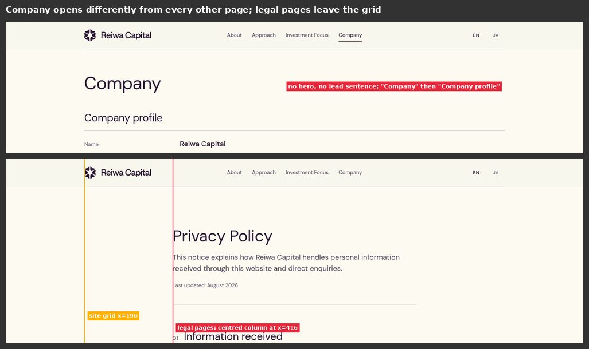

For a firm asking a family office to trust it with an overseas allocation, this is the
largest gap between what the design promises and what the page can substantiate. I am not
suggesting anything be invented; you have said the entity should not be represented
prematurely. It is worth deciding, deliberately, what the earliest honest proof point is.

### 11. Maps

The About maps are a light default basemap with angular purple polygons and label chips
that overlap their edges. They do the job but look like a mapping library's defaults rather
than something designed. Each block shows its Core / Selective legend twice (above the text
and under the map).

### 12. Legal pages and small details

The Privacy and Disclaimer pages use a centred 608px column starting at x = 416 instead of
the site grid at x = 196. Sub-lines across the site mix full stops and none ("substitutes for judgement" has none; most others do).

## Against your six questions

1. **Hierarchy.** Strong on the headline and the first fold; weak in the middle. Six H2
   sizes across five pages, flat subsection headings, and the smallest text carrying the
   most explanation.
2. **Whitespace and density.** Mostly generous and premium. The outliers are specific
   (#8), and the Approach panel is dense to the point of reading as a specification sheet.
3. **Consistency.** The weakest area after imagery. Within a page it is close; across
   pages the same device is rebuilt (#5, #6, #7).
4. **Heroes.** Legibility over the image is fine; the images themselves are the problem
   (#1). The Home composition is good; the inner heroes read as template defaults.
5. **Unfinished or placeholder.** The blurred heroes, the map defaults, the 6.4px numerals,
   the wrapped chip row, the double hairline, the footer collision.
6. **Japanese.** Not an afterthought in intent (serif headlines, sensible line length), but
   it has three real faults: the comma-led line, mid-word breaks, and the unmatched hero.

## What is working

The restraint. One typeface, one warm palette, hairlines as the only ornament. The dark
plum panels on Approach and About feel expensive. The Income, Repositioning and
Hospitality photography is genuinely good, as are the London and Amsterdam skylines. The
Company page's Contact section, the tabbed comparison on About, and the Five Tests ring on
Approach are the most considered pieces on the site and set the standard the rest should
be held to.

## Header note

The header wash on Home was set back to its long-standing see-through fade
(`claude/header-restore`, not yet deployed). That trades legibility of the nav labels over
the pale sky (about 2 : 1, against the 4.5 : 1 a flat band achieved) for the look you
asked for. It is not counted in the ranking above.

## Not covered

Real Safari and real devices, hover and focus states, motion, and the disclaimer and 404
pages beyond a glance. Measurements are Chromium at 1440px and 390px.
